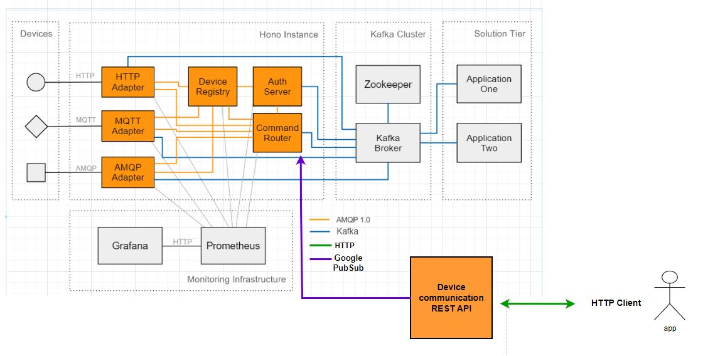

# Device Communication API

Device communication API enables users and applications to send configurations and commands to devices via HTTP
endpoints.



### Application

The application is reactive and uses Quarkus Framework for the application and Vertx tools for the HTTP server.

### Hono internal communication

API uses [Google's PubSub](https://cloud.google.com/pubsub/docs/overview?hl=de) service to communicate with the command
router.

## API endpoints

#### commands/{tenantId}/{deviceId}

- POST : post a command for a specific device (NOT IMPLEMENTED YET)

<p>

#### configs/{tenantId}/{deviceId}?numVersion=(int 0 - 10)

- GET : list of device config versions

- POST: create a device config version

For more information please see resources/api/openApi file.

## Database

Application uses PostgreSQL database. All the database configurations can be found in application.yaml file.

### Tables

- DeviceConfig <br>
  Is used for saving device config versions
- DeviceRegistration <br>
  Is used for validating if a device exist

### Migrations

When Application starts, tables will be created by the DatabaseSchemaCreator service.

### Running PostgreSQL container locally

For running the PostgreSQL Database locally with docker, run:

``````

docker run -p 5432:5432 --name some-postgres -e POSTGRES_PASSWORD=mysecretpassword -d postgres

``````

After the container is running, log in to the container and with psql create the database. Then we have
to set the application settings.

Default PostgreSQL values:

- userName = postgres
- password = mysecretpassword

## Build and Push API Docker Image

Mavens auto build and push functionality can be enabled from application.yaml settings:

````

quarkus:
  container-image:
  builder: docker
  build: true
  push: true
  image: "<registry>/<organization>/hono-device-communication"

````

By running maven package, install or deploy, this will automatically build the docker image and if push is enabled it will
push the image to the given registry.

## OpenApi Contract-first

For creating the endpoints, Vertx takes the openApi definition file and maps every endpoint operation-ID with a specific
Handler function.

## Handlers

Handlers are providing callBack functions for every endpoint. Functions are going to be called automatically from vertx
server every time a request is received.

## Adding a new Endpoint

Adding new Endpoint steps:

1. Add Endpoint in openApi file and set an operationId
2. Use an existing const Class or create a new one under /config and set the operation id name
3. Implement an HttpEndpointHandler and set the Routes


