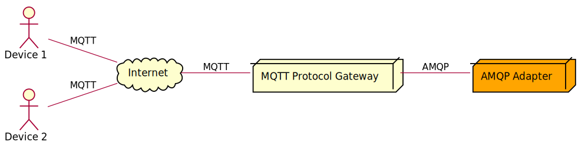

# MQTT Protocol Gateway Template

This project provides a template for creating MQTT 
[protocol gateways](https://www.eclipse.org/hono/docs/concepts/connecting-devices/#connecting-via-a-protocol-gateway) for Eclipse Hono&trade;. 
While Hono contains an [MQTT protocol adapter](https://www.eclipse.org/hono/docs/user-guide/mqtt-adapter/), there are cases when
it cannot be used, e.g., when existing MQTT-enabled devices cannot be updated to use the supported topics of the default protocol adapter. 
Other use cases for an MQTT protocol gateway are special requirements that the protocol adapter does not support, 
such as custom authentication or message transformations, like compression or encryption of the payload. 

This template allows creating protocol gateways quickly and easily. It accepts messages on custom topics and sends 
them to Hono's [AMQP adapter](https://www.eclipse.org/hono/docs/user-guide/amqp-adapter/).
Received commands can be published on custom topics to the device.

The following diagram shows how two devices are connected to an MQTT protocol gateway in the backend, 
which in turn is connected to Hono's AMQP protocol adapter.

## Implement a custom MQTT Protocol Gateway

The template is provided in form of the abstract class `AbstractMqttProtocolGateway`.
The abstract methods must be implemented to handle the following events:

1. when a device connects: authenticate the device
2. when a device subscribes: validate the topic filters
3. when a business application sends a command:
   * determine the topic on which the device expects it
   * select the corresponding subscription
   * (optional) modify the payload
4. when a device sends a message:
   * select the message type (telemetry, event, command response)
   * (if command response) correlate the message to the command
   * (optional) modify the payload
   * (optional) specify the content type
   * (optional) add "application properties"

The abstract class is configured by its constructor parameters.
The `ClientConfigProperties` configure the connection to the AMQP protocol adapter and the `MqttProtocolGatewayConfig`
configures the protocol gateway including the MQTT server.

**NB**  When receiving commands, the AMQP message is settled (and accepted) as soon as the message has been successfully
published to the device. The implementation does not wait for an acknowledgement from the device, regardless of the 
QoS with which the device has subscribed. 
If the business application requires a higher delivery guarantee, it is recommended to use request-response commands.

### Device Registration

The template presumes that the gateway device as well as the devices connecting to it are registered in Hono's
device registry and that the gateway is authorized for the device using the _via_ property, as described on the
[concept page](https://www.eclipse.org/hono/docs/concepts/connecting-devices/#connecting-via-a-device-gateway).

It is not necessary to provision credentials for the devices to Hono's device registry.

### Device Authentication

The protocol gateway is responsible for establishing and verifying the identity of devices.
This template supports both the authentication based on the username and password provided in
an MQTT CONNECT packet and client certificate-based authentication as part of a TLS handshake for this purpose.

For authentication with username, the abstract method _authenticateDevice_ must be implemented.
The provided credentials must be checked there and the tenant ID and device ID of the device must be returned.
Authentication with username is not executed if authentication with client certificate was successful.

To authenticate devices that use X.509 client certificates, two methods must be overridden: one provides the
issuer certificates to be used as trust anchors for validation, and the other must determine the tenant ID and
device ID for the validated client certificate.

To authenticate client certificates that are not based on the X.509 standard, the 'authenticateDeviceCertificate'
method must be overwritten and the entire validation and authentication process implemented.

Authentication with client certificates is only invoked if the connection is secured with TLS.
If it fails, the authentication with username is then invoked.

### Correlation of Commands and Responses

Hono's [Command & Control](https://www.eclipse.org/hono/docs/api/command-and-control) API requires that a
command response must include the correlation ID and the response ID of  the command. 
When using MQTT, there is no canonical way to do this. The following three approaches are conceivable:

1. encode the parameters in the topic and have the device send them back
2. encode them into the payload and have them returned by the device
3. keep them in the protocol gateway and add them there to the response

If the values are sent to the device (first two options), the device must support this and add the
correct data to the response in the required manner.
The 3rd approach means that the protocol gateway is stateful and has the disadvantage that the protocol gateway
can no longer simply be scaled horizontally. The template allows to use any of these strategies.

### Gateway Authentication

Gateways must be registered as devices in Hono's device registry, and the corresponding credentials for authentication must be created.

If all devices connecting to the protocol gateway belong to the same tenant, the credentials of the gateway device
can be configured in the `ClientConfigProperties`, which are passed in the constructor of the class `AbstractMqttProtocolGateway`.
If devices of different tenants are to be connected, the credentials must be determined dynamically, as described below.

### Multi-tenancy

The protocol gateway supports the handling of devices belonging to different tenants.
For this purpose, for each tenant that is supposed to use the protocol gateway, a gateway device must be registered 
in the device registry and corresponding credentials must be created.

The method _provideGatewayCredentials_ must be overwritten. This method is invoked after the (successful) authentication
of a device to provide the gateway credentials for this tenant.

**NB** If credentials for the gateway are present in the configuration, the method _provideGatewayCredentials_ is _not_ invoked.

### Optional Extension Points

The abstract base class exposes some `protected` methods that may be used to extend the behavior of the protocol gateway.
Please refer to the JavaDoc for details.
